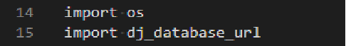

# __GymStore__

The goal of this project is to create an ecommerce webpage that allows users to create buying orders. Users can navigate through the site and choose products to buy as they 

please. This project aims to create a real environment like that of a shopping site.

This virtual store has a profile section area which allows users to become members and save information about their purchases. You can also buy without having the need to 

become a member of the store. In the making of this project CRUD functionality where programmed in python.

In future updates, the goal is to make the store already in real mode, selling products and making payments and not only in a demo enviroment. One other more ambitious update is 
that the store will be available in other languages, this will make it possible to expand the branch of clients that visit the store. 

This is the fourth ms4 project from Code Institute.

# User Experience __(UX)__

## __User Stories__

As a user of this site, I want to

1. As a user, i want to be able to easily understand what the site is about so that i can decide if this is a site of my interest.

2. As a user, i want to easy navigate through the different pages so that i can use the site.

3. As a user, i want to search for products by price and rating so that I can compare which one is better for me to buy.

4. As a user, i want to register an account so that i can become a member.

5. As a user, i want the process of registration to be simple so that i can start make use of the site and not lose interest with registration processes that take a long time.

6. As a user, i want to view a description of the products so that i can see if it is what I am really looking for and it interests me.

7. As a user, i would like to easily be able to add products to the cart . 

8. As a user, i want to see a list of the products that I buy so that i can be able to take an order of my purchases .

9. As a user, i want to add and delete products from my shopping cart.

10. As a user, i want the checkout form to be as clear as possible. i want to see/fill my user information. See a list of what I have bought and have in my cart, the total 

amount to pay.

11. As a User, i want to receive emails with details of my purchases so that I can compare when you arrive the products that everything is received in order to how it was 

purchased.

12. As a User, i want to easily recover my password in case I forget it.

## __The purpose of the GymStore is to :__

+ Create an online commercial store where people can have access to buy products for exercise and nutrition.

+ Create an environment of commerce that assimilates as much as possible to reality.

+ Today online shopping is more common than before. The sale of products from different areas has become a lifestyle. Which opens a way to competition between different 

companies.

The idea of making this online store was born from the ms4 project for Code Institute. The inspiration for this site comes from the Swedish site [gymgrossisten]

(https://www.gymgrossisten.com/).

### __Project Strategy__

To meet the goal of this project, the following strategy has been implemented.

+ Provide CRUD functions are included making it possible for the user to handle their information.

+ The site is built to easy navigate and this makes it also easy to use.

+ A secure checkout page where user can see a detailed list of their products

+ A registration section thus giving the option of being able to track purchases by sending emails

### __Design__

__Color Scheme__

The colours that I used for the site:

* (Black) Background color of all system templates. 

* (White) For the titles in the navbar, and for the texts in the other templates of the website such as buttons, product descriptions, etc.

* (Blue) Is used by the text box where the visa card number is placed on the checkout page

* (Green) Is the default color of the buttons in the checkout page. Also the hover color for the view button in the all product page.

* (Red) It is used for the "shop now" button and the text of the card purchase.

* (Grey) is the hover color for the add to cart button in the all product page and the color main color for the button in the product detail page.

The reason why these colors were chosen is because since the background color is black. It was necessary to use strong colors that contrast with the environment. This contrast allows the user to be more focused 

on what they need and also gives at the same time a typical atmosphere of the gym world. Since in most of these sites and from the site in which this project was inspired, the main background color is black.

### __Typography__

"Roboto" and Sans-Serif font has been used in the website. The reason why this font was chosen is because it makes the text of the site more clear. Roboto has a dual nature. It

has a mechanical skeleton and the forms are largely geometric. Roboto also allows letters to be settled into their natural width. This makes the reading rhythm to be more 

natural.
    
### __Imagery__

The images used for the creation of this project were taken from the Swedish website [gymgrossisten](https://www.gymgrossisten.com/). The picture in the home page is from 

pexels.com. The reason for this choice is that being an online store for exercise products, it is important that the first impression of the user when entering is to understand 

what the site is about. 

The images taken from the gymgrossisten page are only use as images of the products available in the online store.

## __Wireframes__

*******

## __Features__ 

* Responsive on all devices.

* Interactive elements.

* Responsive navbar.

* Designed with HTML5, CSS, Python3, JavaScript, Bootstrap, and Django.

* Register members page where users can register.

* Login page where only register users can have access to.

* The use of stripe as a payment method for purchases.

* Product page ordered in different categories.

* The option to search products by categories, price and rating.

* Shopping cart page where users can see a list of products they have been purchased. Also manage to increase or delete the products they want.

* Checkout page where the payment is generated.

* Email sending to users with details of their purchases

## __Features left to implement in the future__

* A function that makes it possible to recover user password.

* Make it possible to have the ecommerce site in several languages, not just in english.

* Create more product areas with their categories, turning this not only into an ecommerce store but rather a kind of online gallery.

* Add another payment system such as PayPal, giving the user the option to choose the payment system that is most convenient for them.

* A map where the user can mark the cities and places he/she has visited.

* Create a function that allows to send advertasing for new products to registered users.

## __Technologies Used__

+ For the making of this project, the following technologies has been used

##### __Languages__

* [HTML5](https://en.wikipedia.org/wiki/HTML5)

* [CSS3](https://en.wikipedia.org/wiki/CSS)

* [JavaScript](https://en.wikipedia.org/wiki/JavaScript)

* [Python](https://www.python.org/)

#### __Django framework__ 

* [Django](https://www.djangoproject.com/)

  Django is a high-level Python Web framework that encourages rapid development and clean, pragmatic design.

* [Django Allauth](https://django-allauth.readthedocs.io/en/latest/installation.html)

  This is used for register, sign up and sign out pages.

* [Django Crispy Forms](https://django-crispy-forms.readthedocs.io/en/latest/)

  Used for all forms in this project.
  
#### __Integrations__

+ [Fontawesome](https://fontawesome.com/)

  Font Awesome is a font and icon toolkit i use for the icons on different pages.

+ [Googlefonts](https://fonts.google.com/)

  Used in this project for typography.

+ [Booststrap](https://getbootstrap.com/)

  Bootstrap is a free and open-source CSS framework directed at responsive, mobile-first front-end web development. It contains CSS- and (optionally) JavaScript-based design 
  
  templates for typography, forms, buttons, navigation, and other interface components.

### __Repository, workspace__

+ [Gitpod](https://www.gitpod.io/) 

  Gitpod is used as the enviroment program were the page was made and for the writing of the code.

+ [Github](https://github.com/) 

  I use Github to host the deployed website. Also in Github you can track your code and go back to previous versions to keep track of what you've done.

+ [Heroku](https://www.heroku.com/)

  Platform used for the deployments and running the apps. 

## __Resources__
 
+ [Balsamic](https://balsamiq.com/)

  Program use for the making of the wireframes for this project.
  
+ [Stripe](https://stripe.com/en-gb-se)

  I use stripe for the project payment system. In addition, it is one of the requirements of this project.

+ [YouTube](https://www.youtube.com/)

  I use this site to get inspiration from other projects and to search information about source code. 

+  [Markdown](https://guides.github.com/features/mastering-markdown/)

  Markdown is a easy-to-use syntax for styling all forms of writing on the GitHub platform.

+  [W3schools](https://www.w3schools.com/)

  I use this site to get answers to questions about the programming languages used. 
  
+ [Amazon Web Services](https://aws.amazon.com/)

  I use Amazon to store the static and media files.This procedure is performed by saving the corresponding information in the AWS S3 bucket.
  
  https://aws.amazon.com/

## The code is validated in the following pages for error correction:

+ [W3C Validator HTML](https://validator.w3.org/)

+ [JSHint](https://jshint.com/)

+ [CSS](https://jigsaw.w3.org/css-validator/#validate_by_input)

+ [Pep8](http://pep8online.com/)

+ [Reposinator](https://www.responsinator.com/)

+ [Devtool](https://developers.google.com/web/tools/chrome-devtools)

# Data schema

Django works with SQL databases by default. Sqlite3 has been used in the development environment. Instead, when deploying to Heroku, it provides a PostgreSQL database for 

deployment.

## __Product App__

__Product Model__

   Title                 |      Db Key             |   Data Type   |      Comments                                                              |
-----                    | -                       |             - | -                                                                          |
Category                 | category                | ForeignKey    |  on_delete=models.CASCADE                                                  |
Sku                      | sku                     | CharField     | max_length=250, blank=True                                                 |
Name                     | name                    | CharField     | max_length=250                                                             |
Description              | description             | TextField     |                                                                            |
Price                    | price                   | DecimalField  | max_digits=6, decimal_places=2                                             |
Rating                   | rating                  | DecimalField  | max_digits=6, decimal_places=2, blank=True                                 |
Image url                | image_url               | URLField      | max_length=1024, null=True, blank=True                                     |
Image                    | image                   | ImageField    | null=True, blank=True                                                      |
Stock                    | stock                   | IntegerField  | null=True, blank=True                                                      |
Has sizes                | has_sizes               | BooleanFieldv | default=True, null=True, blank=True                                        |

__Category Model__
   Title                 |      Db Key             |   Data Type   |                                 Comments                                   |
-----                    | -                       |             - | -                                                                          |
Name                     | name                    | CharField     | max_length=250                                                             |
Friendly Name            | friendly_name           | CharField     | max_length=250, blank=True                                                 |

## __Cart App__

__Cart Model__
   Title                 |      Db Key             |   Data Type   |                                 Comments                                   |
-----                    | -                       |             - | -                                                                          |
Cart id                  | cart_id                 | CharField     | max_length=250, blank=True                                                 |
Date added               | date_added              | DateField     | auto_now_add=True                                                          |

__Cart_item Model__
   Title                 |      Db Key             |   Data Type   |                                 Comments                                   |
-----                    | -                       |             - | -                                                                          |
Product                  | product                 | ForeignKey    | blank=False, on_delete=models.CASCADE                                      |
Cart                     | cart                    | ForeignKey    | on_delete=models.CASCADE                                                   |
Quantity                 | quantity                | IntegerField  |                                                                            |
Active                   | active                  | BooleanField  | default=True                                                               |

## __Checkout App__

__Order__ 
   Title                 |      Db Key             |   Data Type   |                                 Comments                                   |
-----                    | -                       |             - | -                                                                          |
Order Number             | order_number            | CharField     | max_length=35, null=False, editable=False                                  |
User Profile             | user_profile            | ForeignKey    | on_delete=models.SET_NULL, null=True, blank=True, related_name='orders'    |
Billing Name             | billingName             | CharField     | max_length=250, blank=True                                                 |
Email Address            | emailAddress            | EmailField    | max_length=250, blank=True, verbose_name='Email Adress'                    |
Phone                    | phone                   | CharField     | max_length=15, null=False, default=0                                       |
Billing Country          | billingCountry          | CountryField  | blank_label='Country *', null=False, blank=False                           |
Billing Postcode         | billingPostcode         | CharField     | max_length=250, blank=True                                                 |
Billing City             | billingCity             | CharField     | max_length=250, blank=True                                                 |
Billing Address          | billingAdress1          | CharField     | max_length=250, blank=True                                                 |
Shipping Name            | shippingName            | CharField     | max_length=250, blank=True                                                 |
Shipping Address         | shippingAddress1        | CharField     | max_length=250, blank=True                                                 |
Shipping City            | shippingCity            | CharField     | max_length=250, blank=True                                                 |
Shipping Postcode.       | shippingPostcode        | CharField     | max_length=250, blank=True                                                 |
Shipping Country         | shippingCountry         | CountryField  | blank_label='Country *', null=False, blank=False                           |
created                  | created                 | DateTimeField | auto_now_add=True                                                          |
Delivery Cost            | delivery_cost           | DecimalField  | max_digits=8, decimal_places=2, null=False, default=0                      |
Total                    | total                   | DecimalField  | max_digits=10, null=True, decimal_places=2, verbose_name='USD Order Total' |
Grand Total              | grand_total             | DecimalField  | max_digits=8, decimal_places=2, null=False, default=0                      |
Original Cart            | original_cart           | TextField     | null=False, blank=False, default=''                                        |
Stripe Pid               | stripe_pid              | CharField     | max_length=254, null=False, blank=False, default=''                        |

__Order Line Item__ 
   Title                 |      Db Key             |   Data Type   |                                 Comments                                   |
-----                    | -                       |             - | -                                                                          |
Order                    | order                   | ForeignKey    | null=False, blank=False, on_delete=models.CASCADE, related_name='lineitems |
Product                  | product                 | ForeignKey    | null=False, blank=False, on_delete=models.CASCADE                          |
Product size             | product_size.           | CharField     | max_length=2, null=True, blank=True                                        |
Quantity                 | quantity.               | IntegerField  | null=False, blank=False, default=0                                         |
Lineitem total           | lineitem_total          | DecimalField  | max_digits=6, decimal_places=2, null=False, blank=False, editable=False    |

## __Profile App__

__User Profile__
   Title                 |      Db Key             |   Data Type   | Comments                                                                   |
-----                    | -                       |             - | -                                                                          |
User                     | user                    | OneToOneField | on_delete=models.CASCADE                                                   |
Default Phone            | default_phone           | CharField     | max_length=15, null=True, blank=True                                       |
Default Billing Address  | default_billingAdress1  | CharField     | max_length=250, blank=True                                                 |
Default Billing Country  | default_billingCountry  | CountryField  | blank_label='Country', null=True, blank=True                               |
Default Billing Postcode | default_billingPostcode | CharField     | max_length=250, blank=True                                                 |
Default Billing City     | default_billingCity     | CharField     | max_length=250, blank=True                                                 |

## Testing

   During the testing time, the following code validates are use. 

+ [W3C](https://validator.w3.org/) Validator HTML.

+ [CSS](https://jigsaw.w3.org/css-validator/#validate_by_input) validator CSS.

+ [Pep8](http://pep8online.com/) validator Python

+ [JSHint](https://jshint.com/) JavaScript

## __Testing User Stories from User Experience (UX) Section__ 

1. As a user, i want to be able to easily understand what the site is about so that i can decide if this is a site of my interest.

    i. Entering the page, there is a title, a paragraph and a picture in which it is clearly read what the site is about.

2. As a user, i want to easy navigate through the different pages so that i can use the site.

    i. The main page has a navigation menu in which there are some options. One is a product section where the categories are shown. 

    A section of entry and registration of members of the page as well as the option of shopping bag shown with an icon.

3. As a user, i want to search for products by price and rating so that I can compare which one is better for me to buy.

    i. There is a search option for products where the user can search either by price, rating or product name. 

4. As a user, i want to register an account so that i can become a member.

    i. The user has the option of registering an account in the navigation menu. Once this is done, the user is a registered member.

5. As a user, i want the process of registration to be simple so that i can start make use of the site and not lose interest with registration processes that take a long time.

    i. To register, enter your email, choose a username and a password in the register form. 

6. As a user, i want to view a description of the products so that i can see if it is what I am really looking for.

    i. There are two ways to get to the product description page. The first is by pressing the "Shop now" button on the main page. The second is by going to the navigation menu 
    
    and pressing the all product option.

    ii. Once on the products page press the "view" button, being directed to the product description page.

7. As a user, i would like to easily be able to add products to the cart.

    i. On the "all products" page, as well as on the product detail page, there is the "add to cart" button which allows the chosen product to be entered into the shopping cart.

8. As a user, i want to see a list of the products that I buy so that i can be able to take an order of my purchases.

    i. Once the "add to cart" button is pressed, the user is directed to the cart page a detail list of the products to buy appears.

9. As a user, i want to add and delete products from my shopping cart.

    i. On the cart page, the user also has the possibility of adding, reducing or completely eliminating the product from the shopping cart. This is achieved through icons on
    
    each product detail card.

10. As a user, i want the checkout form to be as clear as possible.

    i. Once the products have been chosen, the user is taken to the checkout page, where a list of the products purchased is displayed, in addition to a form to fill out with 
    
    their personal data.
  
   ii. In this section there is also the payment section, where the user can fill in the credit card details and proceed to pay for the purchase. 

11. As a User, i want to receive emails with details of my purchases so that I can compare that everything is received in order to how it was purchased.

    i. When the data is filled in at the checkout, the email is also filled out. At the end of the purchase, an email is sent with the details to the email that was entered in 
    
    the checkout form.

12. As a User, i want to easily recover my password in case I forget it.

    i. In the sign in form there is an option "forgot password". The user is sent to the reset form, where it should enter the email which use to register the account.

   ii. The user receives an email with a link where they will be taken to the reset form. There it can write the new password.

* During my test period i focus on the user stories.

# __Further Testing__

## The testing of the Navbar and pages. 

### __Home Page__

+ Test result: The user is directed to the "All Products" page when pressing the "Shop now" button in the home page. 

+ Test result: The user is directed to the home page when pressing the logo in the site.

+ Test result: The user is directed to the "All Product page" when pressing the "Products" option in the navbar.

+ Test result: The user can choose different categories when pressing the "Products" option in the navbar, a menu with a list of different categories is displayed.

+ Test result: The user can search products by rating and price when pressing the "Sort" option in the navbar.

+ Test result: The user can search products by name, brand and category in the search box in all the pages where it is displayed.

+ Test result: The user can log and register in the "My Account" icon and label in all the pages where it is displayed.

+ Test result: The user is directed to the cart page when pressing the bag icon in the navbar.

### __Product Page__

+ Test result: The user can view the description of the product by presing the "view" button on the product page. 

+ Test result: The user can add products to the shopping cart by pressing the "Add product" button in the product page.

### __Product detail Page__

+ Test result: The user can add products to the shopping cart by pressing the "Add product" in the product detail page.

+ Test result: The user can choose sizes for the products with this option available and added to the cart in the product detail page.

### __Product add__

+ Test result: The administrator can add products by logging into his account. Then choose "Product management" under "My account".

### __Product edit__

+ Test result: The administrator can edit products by going to the Products option in the navbar. Choosing the option of all the products or a category".

+ Test result: The administrator can delete products. The procedure is as shown above ".

### __Cart Page__

+ Test result: The user can add, remove and delete products.

+ Test result: The user has the possibility to continue shopping by pressing the button "Continue shopping".

+ Test result: The user can add, remove and delete products from the cart page.

+ Test result: The user can go to the checkout page by pressing the "Continue to checkout" button.

### __Checkout Page__

+ Test result: The user was able to fill in his data in the checkout form and complete the order by pressing the button "Complete order"

### __Sign Up Page__

+ Test result: The user can fill in their data in the form to create a new account.

+ Test result: The user is directed to the "Sign in" page when pressing the sign in label message text.

### __Sign In Page__

+ Test result: The user can sign in by filling the sign in form on the page with the data that he/she registered when creating the account.

+ Test result: The user can sign in by filling the sign in form on the page with the data that he/she registered when creating the account.

### __Profile Page__

+ Test result: The user can see his profile page. Once entered the system, go to "My account" and then press "My Profile".

+ Test result: The user can change his information by changing his data in the form "Deafult delivery information".

+ Test result: The user can view his order history in the order history section.

### __The website has been checked in different browser, such as.__

1. Chrome

2. Firefox

3. Safari

4. Microsoft edge

* The responsive part has also been tested in http://www.responsinator.com/ for

1. Ipad

2. Iphone

3. Android

4. Laptop

Friends and family tested the site by login in and writing about their stories. This was also made to point out any bugs and/or user experience issues.

## __Known Bugs__

+ *** 

## __Deployment__

## __Deployment__

### __Heroku__

The Project is deployed to Heroku using the following steps..

 1.- Navigate to [Heroku](https://www.heroku.com/) and log into your account.

 2.- Press the "new" button in the dashboard and choose "Create new app" option.
 
 3.- Write you apps name and choose the region according to where you live.

 4.- Then press the "create app" button.
 
 5.- Go to the Resources tab. Under the Add-ons label in the search box, type "postgres".

 6.- Choose "Heroku Postgres" and the free plan. 

 7.- Then go to the gitpod terminal, and install the following.

+ pip3 install dj_database url 

+ pip3 install psycopg2 binary 
 
 8.- Freeze the requirements in the requirements.txt file by typing: pip3 freeze > requirements.txt
 
 9.- To get the database setup. Go to settings.py and import dj_database_url:

10.- Next, in the database settings, comment out default configuration.
    

11.- Replace the default database with a call to dj_database_url.parse.
    

12.- Go to your heroku account and to "Seetings".

13.- Scroll down to "Config vars" and copy the "DATABASE_URL"
    

10.- Next, in the database settings, comment out default configuration.

11.- Replace the default database with a call to dj_database_url.parse.

12.- Go to your heroku account and to "Seetings".

13.- Scroll down to "Config vars" and copy the "DATABASE_URL"

14.- Back in the settings file. Paste the Database_url code within the parentheses after "...url.parse" (look at the image in point 11).

15.- Save and migrate the changes.

16.- Now, to import all of the product data use the fixtures by loading first the categories and then the products.

+ python3 manage.py loaddata categories
+ python3 manage.py loaddata products

17.- Create a superuser with the following command.
+ python3 manage.py create superuser

18.- After creating the superuser. Go back to the settings file, remove the Heroku database config and uncomment the original (look at pictures in point 10 and 11). This is to 

so that the database url dont end up in version control. 

19.- When this is done, commit the changes.

20.- Go to the settings file and write an if statement. This is done so that when our app is running on Heroku, where database URL environment variable is defined, we connect to 

Postgres, and not to sqlite.

21.- Next install unicorn, which acts as our webserver.

+ pip3 install unicorn

22.- Then freeze that into our requirements.txt file.

+ pip3 freeze > requirements.txt 

23.- Now lets create our Procfile. This will tell Heroku to create a web dyno, that will run unicorn and serve our django app.

+ python3 manage.py loaddata categories

+ python3 manage.py loaddata products

17.- Create a superuser with the following command.

+ python3 manage.py create superuser

18.- After creating the superuser. Go back to the settings file, remove the Heroku database config and uncomment the original (look at pictures in point 10 and 11). This is to 

so that the database url dont end up in version control. 

19.- When this is done, commit the changes.

20.- Go to the settings file and write an if statement. This is done so that when our app is running on Heroku, where database URL environment variable is defined, we connect to 

Postgres, and not to sqlite.

21.- Next install unicorn, which acts as our webserver.

+ pip3 install unicorn

22.- Then freeze that into our requirements.txt file.

+ pip3 freeze > requirements.txt 

23.- Now lets create our Procfile. This will tell Heroku to create a web dyno, that will run unicorn and serve our django app.

24.- Now temporarily disable collecstatic. In the terminal type the following.

25.- Add the hostname of our Heroku app to allowed hosts in settings.py, add localhost and: ALLOWED_HOSTS = ['YOUR-APP-NAME.herokuapp.com', 'localhost'].

26.- Commit the changes and push to Heroku with.

27.- To automatically deploy on Heroku when we push to github, take the following steps.

+ Go to your Heroku app and in into the "Deploy" tab. 

+ In the "Deployment method" section set it to "connect to github"

+ Search for the repository you are using and then click connect.

28.-Next step is top enable automatic deploys. To do that click the "Enable Automatic Deploys" button in the Automatic deploys section.

29.- You will need a new secret key to enter in your Heroku Config Vars (you can create one by using an online [Django secret key generator](https://miniwebtool.com/django-secret-key-generator/).

30.- Once you got your secret key, go to your heroku app and enter the key into the cofig vars in settings.

31.- Now go back to you settings file and replace the secret key with the call to get it from the environment.

32.- Finally, commit and push this changes to github.

### __AWS account__

AWS is a cloud based storage service, used to store static files and images

1.- To create an account, go to [aws.amazon.com](https://aws.amazon.com/) and click "Create an AWS Account".

2.- After filling the required information and creating the account (using the free version will be sufficient).

3.- Go back tto [aws.amazon.com](https://aws.amazon.com/) and sign into "AWS Management Console", located in the upper right part of the screen under "My Account".

4.- Once you signed in, search for the S3 service.

5.- Open S3 and create a new bucket. This will be use to store our files.

6.- Choose a name for your bucket and select the region closest to you, just like you did in the Heroku app.

7.- Uncheck "Block all public access" and acknowledge that the bucket will be public. This must be done so that our static files can have public access.

8.- Once the bucket is creted, we must set a few settings.

9.- Go to the properties tab and turn on "Static website hosting".

10.- In the index and error document , just fill some deafult values since they will not be use. 

11.- Next, got to the "Permissions" tab and make three changes.

+ First, paste a CORS configuration. This is to set up the required access between the Heroku app and the s3 Bucket.

+ Go to the bucket policy tab and select policy generator so we can create a security policy for this bucket.

+ The policy type is going to be s3 bucket policy. This will allow all principals by using a star, and the action will be, get object

+ Next copy the ARN which stands for Amazon resource name from bucket policy tab and paste it into the ARN box here at the bottom, click Add Statement, click Generate Policy and 

  copy the policy into the bucket policy editor.

+ Before clicking Save, add a slash star into the end of the resource key. This is done so we can have allow access to all resources in the bucket.

+ Now click save.

+ The last thing to do, is to go to the access control list tab, and set the list objects permission for everyone under the Public Access section.

12.- Now we need to create a user to access the bucket. This is done by using another service called IAM which stands for Identity and Access Management.

13.- Go to the services menu and click IAM.

14.- Click groups under "Access management" and create a new group (keep clicking "next" button to Create Group).

15.- Create the policy to access our bucket by clicking policies and then create policy.

16.- Next, go to the JSON tab and then select import managed policy, search for s3 in the list and import the s3 full access policy.

17.- Get the bucket ARN from the bucket policy page in s3, and paste it in the JSON section.

18.- Click review policy, give it a name and a description, and then click create policy.

19.- Go to groups and click the group you created. And last click attach policy.

20.- Search for the policy you just created, select it and click "Attach policy" button.

21.- Create a user to put in the group. On the user's page, click "add user", create a user ("YOUR_STORE_NAME-staticfiles-user) , give them programmatic access, and select "next".

22.- Now add the user to your group. You can verify that also the policy is attached. Click through to the end and create the user.

23.- Now download the CSV file which will contain this users access key and secret access key which we'll use to authenticate them from our Django app.

+ Important! After downloading the CSV file save it. This is because once you go through this process, you can't download it again.

24.- To Connect Django to s3 bucket, Install 2 new packages:

+ pip3 install boto3

+ pip3 install django-storages

25.- Then freeze requirements.

+ pip3 freeze > requirements.txt

26.- Next add storages to the installed app since Django need to know about it.

27.- To connect Django to s3 you need to add some settings in settings.py to tell it which bucket it should be communicating with.

28.- Go to Heroku and add your AWS keys to the "Config variables". Also the key called "USE_AWS" and set it to true. This is for the settings file knows to use AWS configuration 

when making a deploy toi Heroku.

29.- Next remove the disable collectstatic variable.

30.- In our settings file, we need to tell django where our static files will be coming from in production.

31.- Create custom storages file.

32.- Go to settings.py, and write the following code for "Static and media files" and also the code to override and set the URLs for static and media files.

33.- Last thing to do, is to Add/commit changes and git push. This will trigger an automatic deployment to heroku.

### __Credits__

__Code__

[Bootstrap](https://getbootstrap.com/)

+ Library used throughout the project in the making of the website and to make it responsive.

* [Online Tutorials](https://www.youtube.com/watch?v=enBAFo2kEfE)

+ For the use of button effects and other features of the site. I search information from Open tutorials

* [Websolutions](https://www.websolutions.com/blog/7-of-the-most-common-website-errors-and-what-they-mean/)

+ I use this site to get information about the website errors encounter in this project.

__Content__

+ I use the Boutique Ado project tutorial from Code Institute as a guidance in the making of this project. 

+ Part of the code written is my code and ideas and guidance from my mentor Antonio Rodriguez.

+ I use the readme file template from Code Institute for the making of my readme file.

__Media__

All Images are from the following site:

+ [Pexels](https://www.pexels.com/sv-se/)

+ [Gymgrossisten](https://www.gymgrossisten.com/)

__Acknowledgements__

+ My beautiful wife and journalist Sara Johansson for her patience, understanding and use of the system.

+ My Mentor Antonio Rodriguez for continuous helpful feedback.

+ Tutor support at Code Institute for their support and help.

+ My friend Christian Mossberg for guidance and support.
